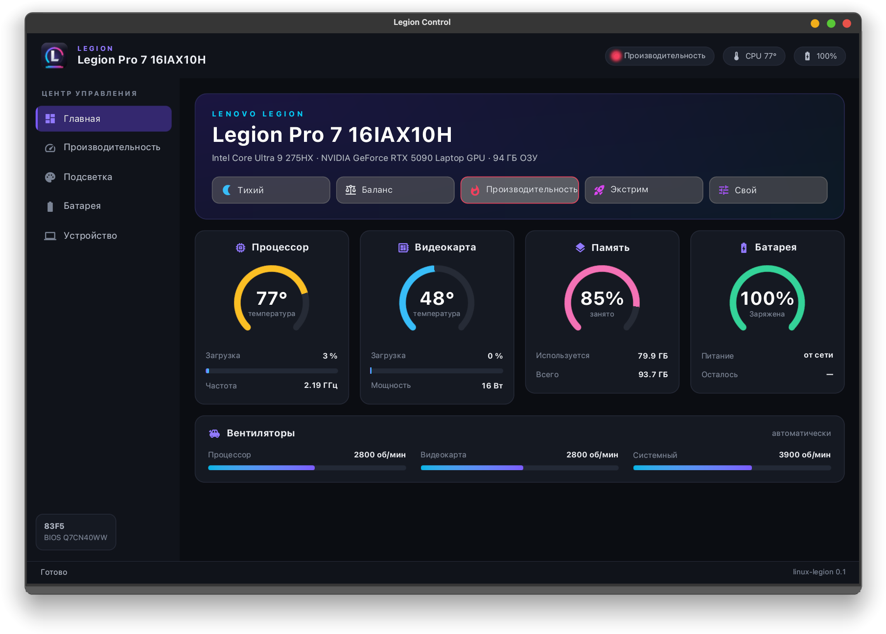
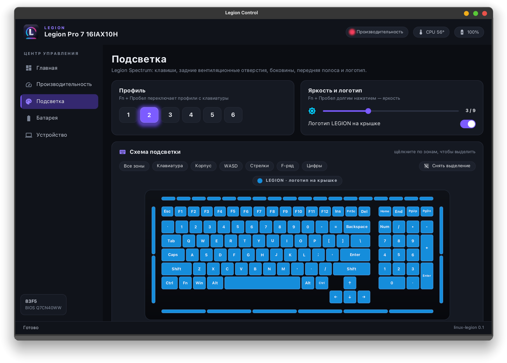
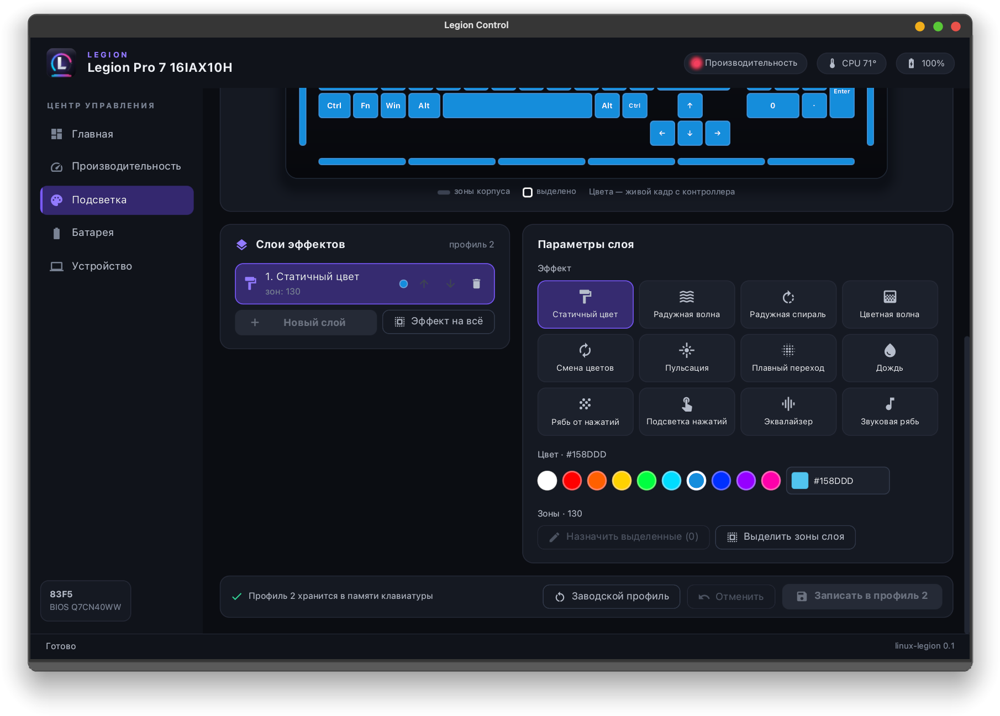
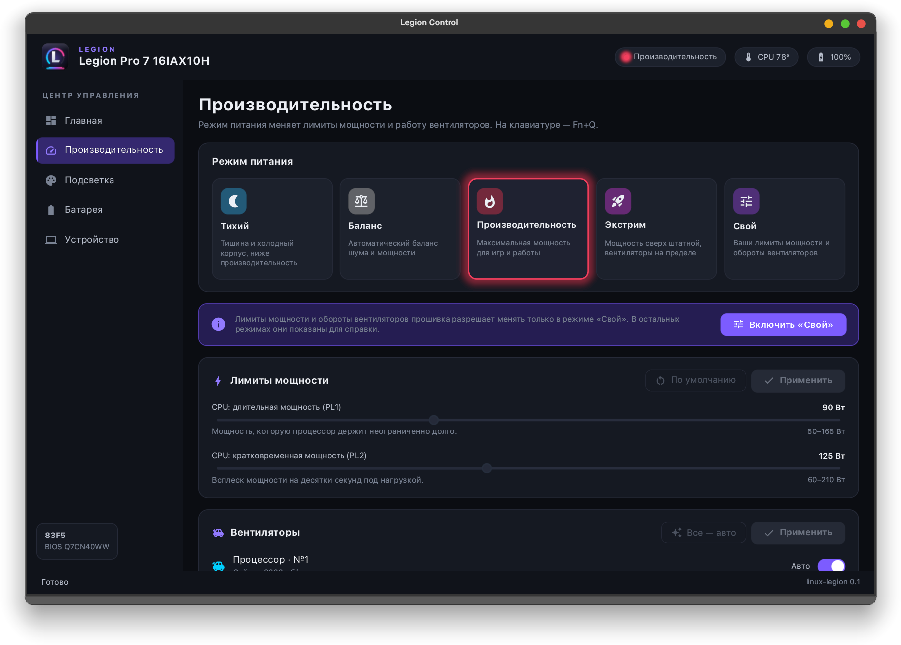
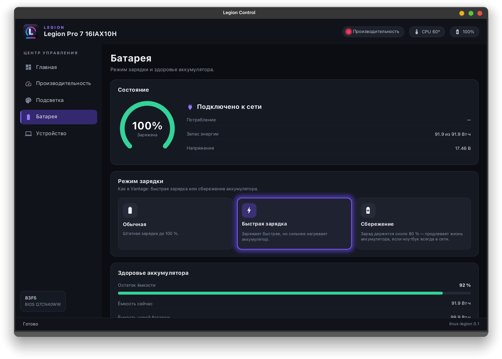
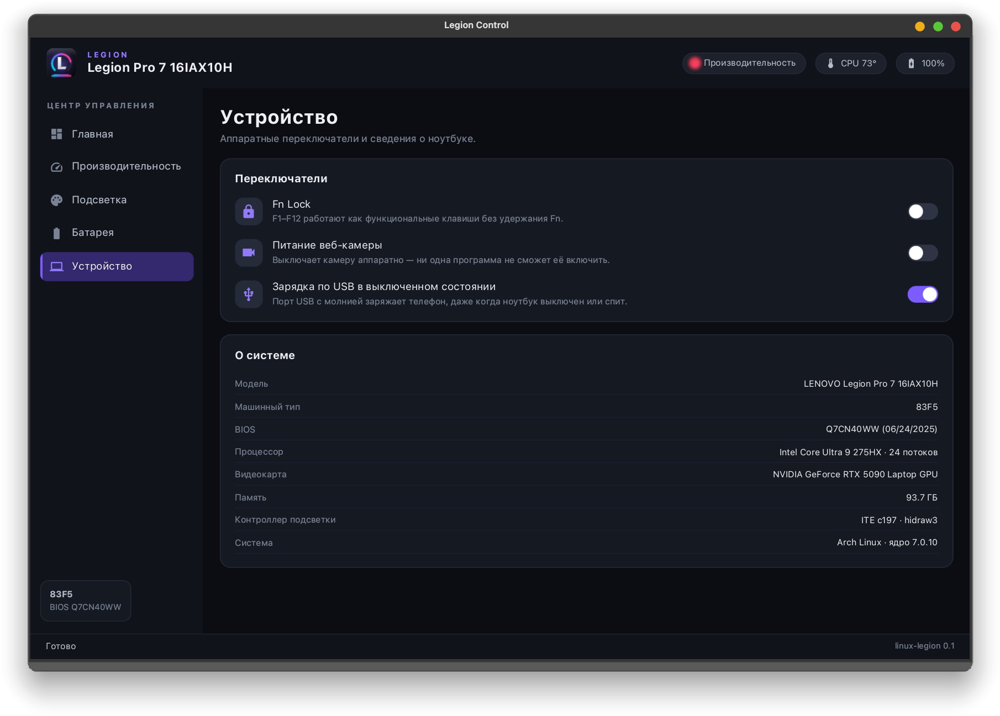

# linux-legion

A Linux control center for **Lenovo Legion** laptops — what Lenovo Vantage / Legion Space does on
Windows: power modes, CPU power limits, fans, per-key **Spectrum RGB** lighting, battery charging
modes and hardware switches.

Written in Rust on [syngui](https://github.com/VitaminDB/syngui). Uses the upstream kernel drivers
(`lenovo-wmi-gamezone`, `lenovo-wmi-other`, `ideapad-laptop`) and talks to the RGB controller
directly through `hidraw` — no out-of-tree kernel module, no daemon, no root at runtime.

<p align="center"></p>



| Spectrum lighting — live map | Effect layers |
|---|---|
|  |  |

| Performance | Battery | Device |
|---|---|---|
|  |  |  |

> The interface is in Russian for now.

## What it does

- **Home** — power mode in one click, live CPU / GPU / memory / battery gauges and fan speeds.
  The NVIDIA GPU is polled only while it is already awake, so the dashboard never wakes the dGPU.
- **Performance** — Quiet / Balanced / Performance / Extreme / Custom (the same as Fn+Q).
  In *Custom*: CPU PL1/PL2 and every other limit the firmware exposes, and manual fan targets.
- **Lighting (Spectrum)** — six hardware profiles (Fn+Space), brightness, the LEGION lid logo,
  and a layer editor: select keys and case zones on a live map (colours are read back from the
  controller ~10 times a second) and assign any of 12 effects with speed, direction and colours.
  Profiles are stored in the keyboard itself.
- **Battery** — charging mode (Standard / Rapid charge / Conservation ≈80 %), charge and health.
- **Device** — Fn Lock, camera kill switch, always-on USB charging, system information.

## Supported hardware

Developed and tested on **Legion Pro 7 16IAX10H** (83F5, Intel Core Ultra 9 275HX,
RTX 5090 Laptop, Spectrum controller ITE `048d:c197`), Arch Linux, kernel 7.0.

Other Legion models with the same kernel interfaces and a Spectrum controller (`048d:c1xx` /
`048d:c9xx`, feature report `0x07` of 960 bytes) should work; every page adapts to what the
firmware reports. `linux_legion --simulate` shows the whole UI without the hardware.

## Install

### Arch Linux

```bash
git clone https://github.com/VitaminDB/linux-legion
cd linux-legion/packaging/aur/linux-legion
makepkg -si
```

The package installs `/usr/bin/linux-legion`, a menu entry, icons and the udev rule.

### From source

```bash
git clone https://github.com/VitaminDB/linux-legion
cd linux-legion
cargo build --release
sudo install -Dm644 packaging/70-linux-legion.rules /etc/udev/rules.d/70-linux-legion.rules
sudo udevadm control --reload-rules && sudo udevadm trigger
./target/release/linux_legion
```

The udev rule gives the logged-in user access to the RGB controller (`uaccess`) and makes the
sysfs knobs (power mode, power limits, fan targets, battery mode, Fn Lock…) writable for the
`wheel` group.

## Usage

```bash
linux_legion                 # control the laptop
linux_legion --simulate      # demo mode with a simulated Legion Pro 7
linux_legion --page 2        # open a page (0 home … 4 device)
LEGION_TRACE=1 linux_legion  # print every RGB packet to stderr
```

## Kernel interfaces

| Feature | Interface |
|---|---|
| Power mode | `/sys/class/platform-profile/*/profile` (`lenovo-wmi-gamezone`) |
| Power limits | `/sys/class/firmware-attributes/lenovo-wmi-other-0/attributes/*/current_value` — accepted only in *custom* mode, otherwise `EBUSY` |
| Fans | hwmon `lenovo_wmi_other`: `fanN_input`, `fanN_target` (0 = auto; *custom* mode only) |
| Battery mode | `/sys/class/power_supply/BAT0/charge_types` (`Fast` / `Standard` / `Long_Life`) |
| Switches | `ideapad_acpi`: `fn_lock`, `camera_power`, `usb_charging` |

## Spectrum protocol

For anyone porting this elsewhere. The command set matches the one Lenovo Legion Toolkit
reverse-engineered for earlier generations; the Gen 10 findings below were made on real hardware.

- One **feature report `0x07`, 960 bytes**. Request `[07] [op] [C0] [03] [params…]` via
  `HIDIOCSFEATURE`, the answer is read with `HIDIOCGFEATURE` as `[07] [op] [len] [00] [data…]`.
- `HIDIOCGFEATURE` without a pending answer returns the **current frame**: `[07] [03] …` followed by
  `(u16 zone, r, g, b)` records — colours already scaled by brightness.
- Operations: `D1` compatibility, `C4`/`C5` zone matrix (22 × 9 on the Pro 7, plus the lid logo
  `0x5DD`), `CA`/`C8` get/set profile, `CD`/`CE` brightness 0–9, `A5`/`A6` logo, `CC`/`CB`
  get/set profile layers, `C9` factory profile.
- Layer record: `[n] 06 01 [type] 02 [speed] 03 [rotation] 04 [direction] 05 [colour mode] 06 00
  [#colours] [rgb…] [#zones] [u16 zone…]`. Full encoder/decoder with tests:
  [`src/spectrum/protocol.rs`](src/spectrum/protocol.rs).
- **Gen 10 quirks** (`048d:c197`):
  - the answer takes up to ~50 ms; reading too early returns the *previous* answer and drops the
    pending one, so the request has to be re-sent;
  - an unread answer stays in the buffer until the next read — even across processes — so the
    buffer is flushed before every request;
  - **reading a profile's layers (`CC`) makes that profile active**;
  - the length byte of `CB` is echoed back on read; the firmware's own profiles use `C0`.
- Case zones on the Pro 7 16IAX10H: rear vents `0x3E9–0x3FA` (18), sides `0x1F5/0x1F6/0x1FD/0x1FE`,
  front light bar `0x1F7–0x1FC`, lid logo `0x5DD`. The second ITE device (`048d:c193`, "Lenovo
  Lighting") speaks a different protocol and is not used yet.

## Project layout

```text
src/hw/         sysfs: power modes and limits, fans, battery, switches, sensors, demo sysfs tree
src/spectrum/   RGB protocol, hidraw transport, simulator, physical keyboard layout
src/worker.rs   background thread: polling and hardware commands
src/ui/         the window: home, performance, lighting, battery, device pages
packaging/      udev rule, .desktop entry, PKGBUILD
```

`cargo test` runs the unit tests (including packets captured from a live keyboard).
`cargo test -- --ignored live_` writes test layers to an inactive profile of the real keyboard,
reads them back and restores the original profile byte for byte.

## Disclaimer

Unofficial project, not affiliated with or endorsed by Lenovo. "Lenovo", "Legion" and "Vantage"
are trademarks of their owners. Power limits and fan targets are applied through the vendor's own
firmware interfaces, but you use this tool at your own risk.

## License

[MIT](LICENSE)
