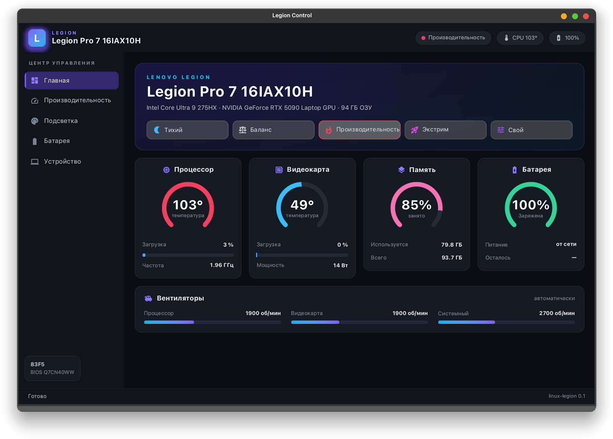
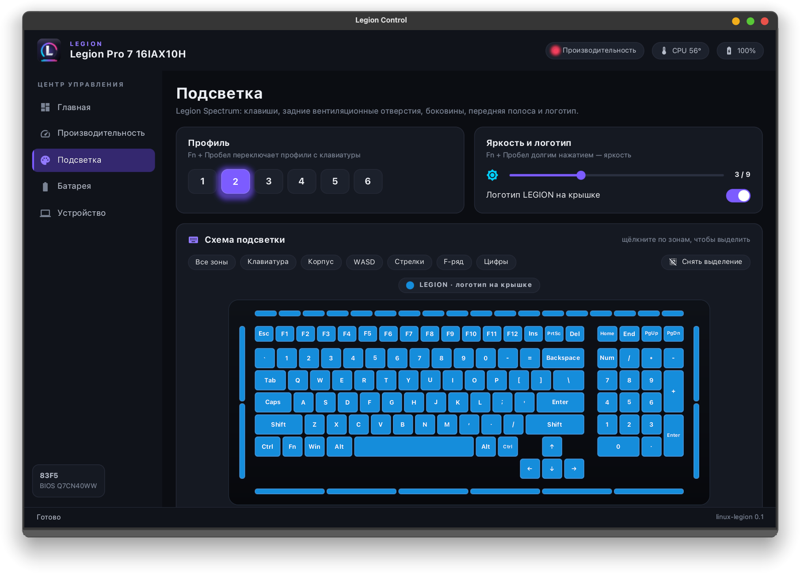
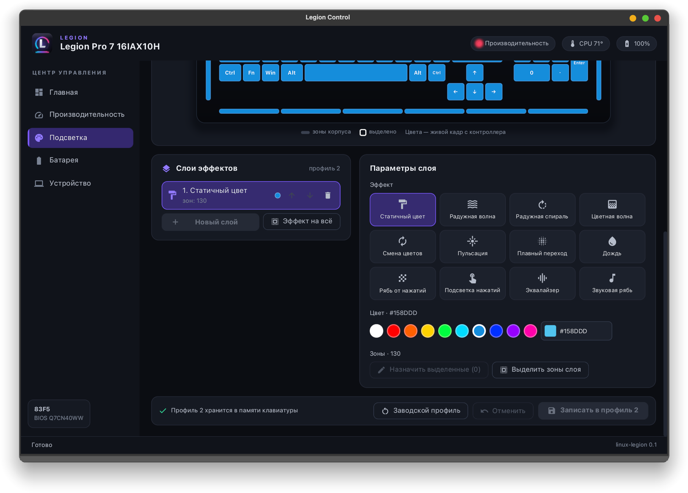
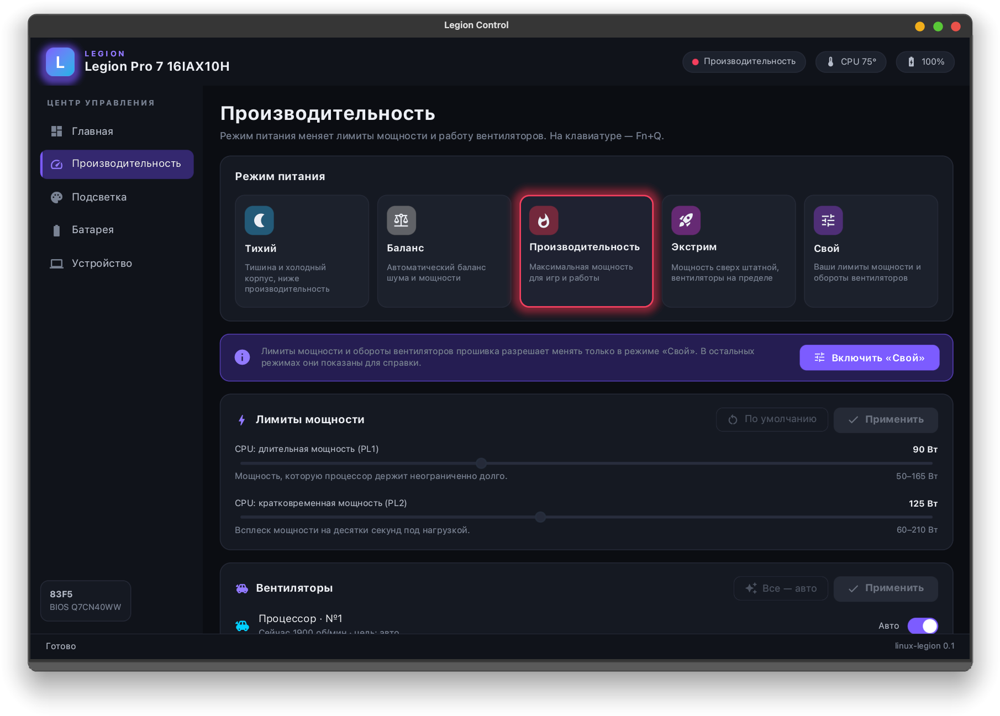
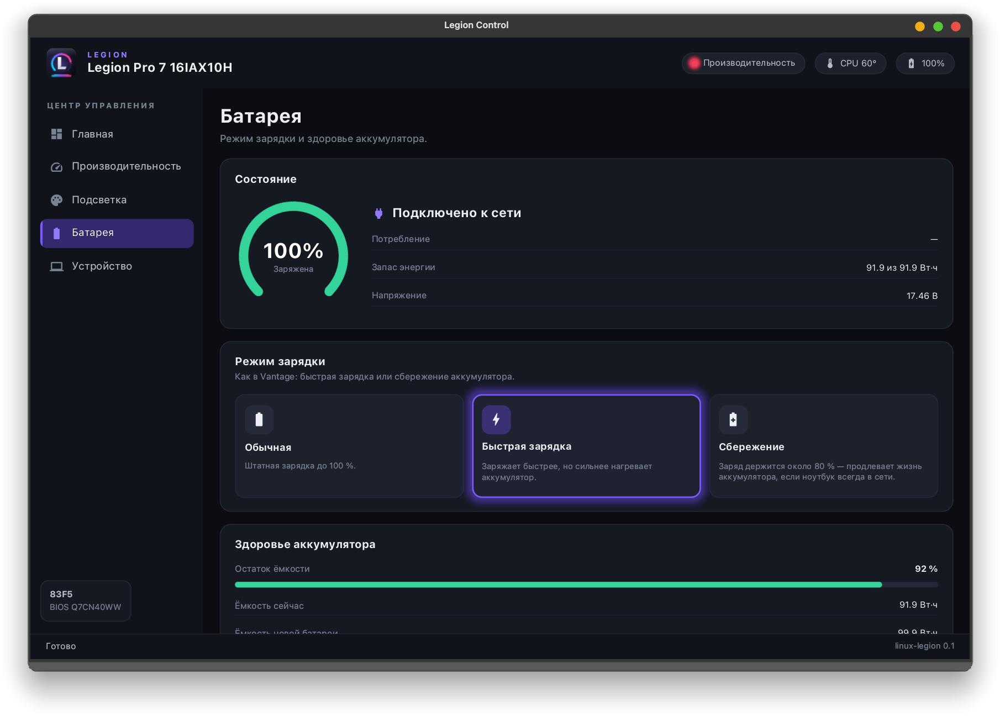
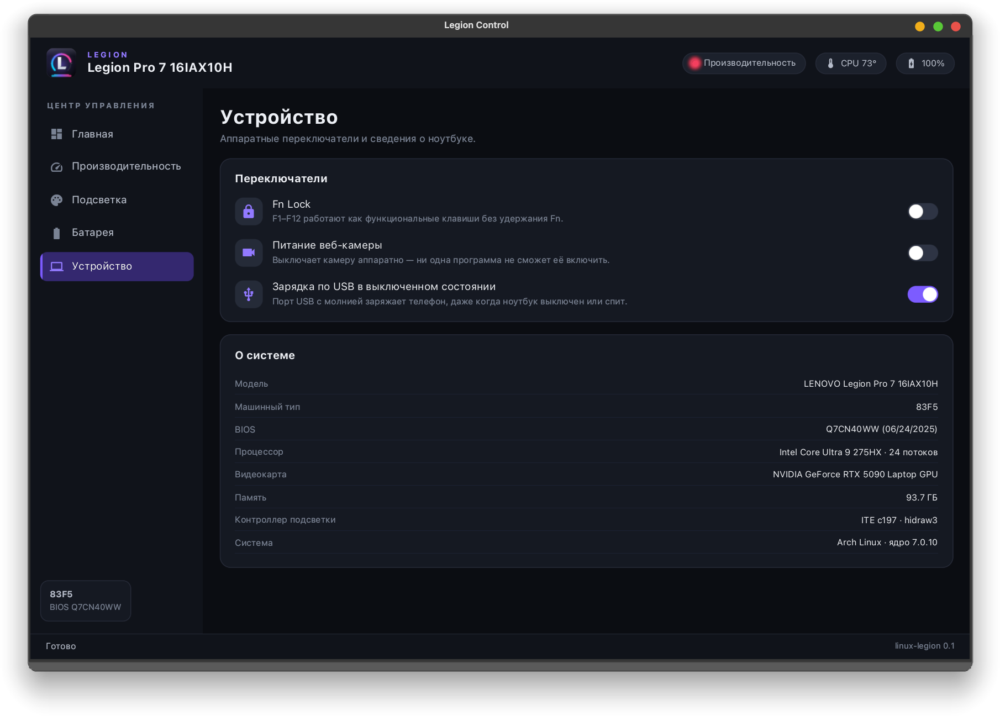

# linux-legion

[](#how-it-is-built)

A Linux control center for **Lenovo Legion** laptops — what Lenovo Vantage / Legion Space does on
Windows: power modes, CPU power limits, fans, per-key **Spectrum RGB** lighting, battery charging
modes and hardware switches.

Written in Rust on [syngui](https://github.com/VitaminDB/syngui). Uses the upstream kernel drivers
(`lenovo-wmi-gamezone`, `lenovo-wmi-other`, `ideapad-laptop`) and talks to the RGB controller
directly through `hidraw` — no out-of-tree kernel module, no root at runtime (a small user
service keeps the CPU power limits and fans in line with the selected mode).

<p align="center"></p>



| Spectrum lighting — live map | Effect layers |
|---|---|
|  |  |

| Performance | Battery | Device |
|---|---|---|
|  |  |  |

> The interface is in Russian for now.

## What it does

- **Home** — power mode in one click, live CPU / GPU / memory / battery gauges and fan speeds.
  The NVIDIA GPU is polled only while it is already awake, so the dashboard never wakes the dGPU.
- **Performance** — Quiet / Balanced / Performance / Extreme / Custom (the same as Fn+Q).
  In *Custom*: CPU PL1/PL2 and every other limit the firmware exposes (with a *Maximum* preset),
  and manual fan targets.
  **CPU limits per mode (RAPL)**: on the Legion Pro 7 Gen 10 the BIOS writes 30/30 W into RAPL
  MMIO at boot and never touches it again — on Windows Legion Space applies the per-mode limits,
  on Linux nobody does, so the CPU is stuck at 30 W in every mode. The service writes Lenovo's own
  values (Quiet 55/65, Balanced 90/125, Performance 145/190, Extreme 160/205 W, Custom = the
  firmware limits you set) into both RAPL interfaces and keeps them there.
  **EPP per mode** (optional): `performance` in Performance/Extreme/Custom, `balance_performance`
  in Balanced, `balance_power` in Quiet — overrides tuned / power-profiles-daemon.
  **Software fan curve**: see [Fans](#fans) below.
  **Auto-apply**: the firmware forgets the Custom values after a reboot (fan targets also after
  sleep); the service restores them at login, whenever Custom mode is switched on (Fn+Q) and after
  resume.
- **Lighting (Spectrum)** — six hardware profiles (Fn+Space), brightness, the LEGION lid logo,
  and a layer editor: select keys and case zones on a live map (colours are read back from the
  controller ~10 times a second) and assign any of 12 effects with speed, direction and colours.
  Profiles are stored in the keyboard itself.
- **Battery** — charging mode (Standard / Rapid charge / Conservation ≈80 %), charge and health.
- **Device** — Fn Lock, camera kill switch, always-on USB charging, system information.

## Supported hardware

Developed and tested on **Legion Pro 7 16IAX10H** (83F5, Intel Core Ultra 9 275HX,
RTX 5090 Laptop, Spectrum controller ITE `048d:c197`), Arch Linux, kernel 7.0.

Other Legion models with the same kernel interfaces and a Spectrum controller (`048d:c1xx` /
`048d:c9xx`, feature report `0x07` of 960 bytes) should work; every page adapts to what the
firmware reports. `linux_legion --simulate` shows the whole UI without the hardware.

## Install

### Arch Linux (AUR)

```bash
yay -S linux-legion        # or paru -S linux-legion
```

The package installs `/usr/bin/linux-legion`, a menu entry, icons and the udev rule.

### From source

```bash
git clone https://github.com/VitaminDB/linux-legion
cd linux-legion
cargo build --release
sudo install -Dm644 packaging/70-linux-legion.rules /etc/udev/rules.d/70-linux-legion.rules
sudo udevadm control --reload-rules && sudo udevadm trigger
./target/release/linux_legion
```

The udev rule gives the logged-in user access to the RGB controller (`uaccess`) and makes the
sysfs knobs (power mode, power limits, fan targets, RAPL, EPP, battery mode, Fn Lock…) writable
for the `wheel` group.

## Usage

```bash
linux_legion                 # control the laptop
linux_legion --apply         # apply saved Custom-mode limits and fans once
linux_legion --daemon        # the auto-apply service (linux-legion-autoapply.service)
linux_legion --simulate      # demo mode with a simulated Legion Pro 7
linux_legion --page 2        # open a page (0 home … 4 device)
LEGION_TRACE=1 linux_legion  # print every RGB packet to stderr
```

## The service

Everything the service does is configured in `~/.config/linux-legion/custom.conf` (the toggles
on the Performance page edit it); the toggle *Service* runs
`systemctl --user enable --now linux-legion-autoapply.service`.

```text
tunable.ppt_pl1_spl=95       # Custom mode: firmware limits, applied with "Apply"
fan.1=3000                   # Custom mode: fan target, 0 = automatic
fan.curve=1                  # software fan curve (see Fans)
cpu.rapl=1                   # per-mode CPU limits in RAPL (default on)
cpu.epp=0                    # per-mode EPP (default off)
rapl.performance=150/190     # your own PL1/PL2 for a mode (quiet, balanced, performance, extreme)
```

`linux_legion --apply` applies everything once; `--daemon` is what the unit runs. The service
re-checks the limits every 5 s (writes only when something differs), the fans every 2 s.

## Fans

The kernel's `fanN_target` (0 = auto) talks to the EC command that Legion Space uses for its
per-fan RPM sliders. On the Legion Pro 7 Gen 10 EC (83F5 / Q7CN) that command is **one-way**: once
a manual RPM has been written, the EC never goes back to its own curve — not after writing 0
(that stops the fan until the thermal floor kicks in), not after a mode switch, the fan table,
the full-speed flag, suspend or a warm reboot. Only an EC reset helps: shut down, unplug the
charger, hold the power button for 30 s (or the pin-hole reset), boot.

So *Software fan curve* exists: when it is on, the service drives all fans by CPU / GPU
temperature (fan 1 — CPU, fan 2 — GPU, fan 4 — the hotter of the two) with a curve scaled by the
mode (Quiet ×0.7 … Extreme ×1.35); in Custom mode the targets you set are kept as they are, except
above 95 °C where they are raised to the curve. Speeds rise immediately and fall only after three
consecutive lower readings, so they do not hunt. It turns on automatically the first time you
apply a manual fan target.

## Kernel interfaces

| Feature | Interface |
|---|---|
| Power mode | `/sys/class/platform-profile/*/profile` (`lenovo-wmi-gamezone`) |
| Power limits | `/sys/class/firmware-attributes/lenovo-wmi-other-0/attributes/*/current_value` — accepted only in *custom* mode, otherwise `EBUSY` |
| Fans | hwmon `lenovo_wmi_other`: `fanN_input`, `fanN_target` (0 = auto on paper; see [Fans](#fans)) |
| CPU limits | powercap `intel-rapl:0` and `intel-rapl-mmio:0`, `constraint_{0,1}_power_limit_uw` |
| EPP | cpufreq `policy*/energy_performance_preference` |
| Battery mode | `/sys/class/power_supply/BAT0/charge_types` (`Fast` / `Standard` / `Long_Life`) |
| Switches | `ideapad_acpi`: `fn_lock`, `camera_power`, `usb_charging` |

## Spectrum protocol

For anyone porting this elsewhere. The command set matches the one Lenovo Legion Toolkit
reverse-engineered for earlier generations; the Gen 10 findings below were made on real hardware.

- One **feature report `0x07`, 960 bytes**. Request `[07] [op] [C0] [03] [params…]` via
  `HIDIOCSFEATURE`, the answer is read with `HIDIOCGFEATURE` as `[07] [op] [len] [00] [data…]`.
- `HIDIOCGFEATURE` without a pending answer returns the **current frame**: `[07] [03] …` followed by
  `(u16 zone, r, g, b)` records — colours already scaled by brightness.
- Operations: `D1` compatibility, `C4`/`C5` zone matrix (22 × 9 on the Pro 7, plus the lid logo
  `0x5DD`), `CA`/`C8` get/set profile, `CD`/`CE` brightness 0–9, `A5`/`A6` logo, `CC`/`CB`
  get/set profile layers, `C9` factory profile.
- Layer record: `[n] 06 01 [type] 02 [speed] 03 [rotation] 04 [direction] 05 [colour mode] 06 00
  [#colours] [rgb…] [#zones] [u16 zone…]`. Full encoder/decoder with tests:
  [`src/spectrum/protocol.rs`](src/spectrum/protocol.rs).
- **Gen 10 quirks** (`048d:c197`):
  - the answer takes up to ~50 ms; reading too early returns the *previous* answer and drops the
    pending one, so the request has to be re-sent;
  - an unread answer stays in the buffer until the next read — even across processes — so the
    buffer is flushed before every request;
  - **reading a profile's layers (`CC`) makes that profile active**;
  - the length byte of `CB` is echoed back on read; the firmware's own profiles use `C0`.
- Case zones on the Pro 7 16IAX10H: rear vents `0x3E9–0x3FA` (18), sides `0x1F5/0x1F6/0x1FD/0x1FE`,
  front light bar `0x1F7–0x1FC`, lid logo `0x5DD`. The second ITE device (`048d:c193`, "Lenovo
  Lighting") speaks a different protocol and is not used yet.

## Project layout

```text
src/hw/         sysfs: power modes and limits, fans, battery, switches, sensors, demo sysfs tree
src/spectrum/   RGB protocol, hidraw transport, simulator, physical keyboard layout
src/worker.rs   background thread: polling and hardware commands
src/ui/         the window: home, performance, lighting, battery, device pages
src/autoapply.rs  the service: Custom-mode auto-apply, per-mode RAPL/EPP, software fan curve
packaging/      udev rule, systemd user unit, .desktop entry, PKGBUILD
```

`cargo test` runs the unit tests (including packets captured from a live keyboard).
`cargo test -- --ignored live_` writes test layers to an inactive profile of the real keyboard,
reads them back and restores the original profile byte for byte.

## How it is built

This project is vibe-coded. Since spring 2026 I write all of my projects with [Claude
Code](https://claude.com/claude-code): I decide what to build and how it fits together,
describe each task, and review, run and measure the result on my own hardware — the model
writes the code, the tests and most of the documentation. Every packet format was captured from
and tested on my own Legion laptop.

## Disclaimer

Unofficial project, not affiliated with or endorsed by Lenovo. "Lenovo", "Legion" and "Vantage"
are trademarks of their owners. Power limits and fan targets are applied through the vendor's own
firmware interfaces, but you use this tool at your own risk.

## License

[MIT](LICENSE)
